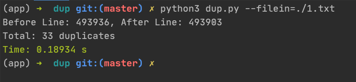

<p align="center">
  <b>dup 是一个用来过滤重复文本内容</b>
  <p align="center">
    
    
  </p>
</p>




## Install
```
git clone --depth=1 https://github.com/xjh22222228/dup.git
```


## Usage
- filein 指定需要过滤文本路径
- fileout 可选, 指定过滤后输出路径，默认当前下的 out.txt

```bash
python3 dup.py --filein=./example.txt

python3 dup.py --filein=./example.txt --fileout=./out.txt
```

文本需要是 `utf-8` 编码


## License
MIT

